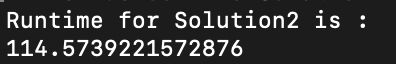
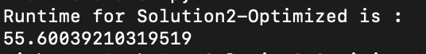

# Calculating genomic coverage from next-generation sequencing data

### Below solutions are provided by Lingyu Chen

## Solutions

### 1. Brute-Forece

  - Intuition: For every position in "loci.csv", traverse data from "reads.csv", count the time that the position is covered.
  - Complexity: 
     - Time: O(M * N)
     - Space: No extra space, assuming that we must use basic collections to store data.
     - Where M is the length of "loci.csv", N is the length of "reads.csv"

### 2. Regular Frequency Dictionary

  - Intuition: Trade off between time and space. Using extra space, a dictionary to maintain all possible positions' frequency.
  - Complexity: 
     - Constructing dictionary:
        - time: O(N*L)
        - space: O(N*L)
     - Appending coverages:
        - time: O(M)
        - space: O(M) 
    - Where M is the length of "loci.csv", N is the length of "reads.csv", L is the average length of intervals
    
  - Runtime: \
    

### 3. Solution 2 Optimization : Memorized Frequency Dictionary

  - Intuition: There is no need to record all possible position in the dictionary. Maintaining only the boundaries is enough. The approach is for every piece of DNA, say it is [100, 110), 
  we have dict[100] + 1, and dict[110]-1. Meantime, we keep tracking of maximum & minimum positions appeared. Then continue constructing the map, for keys from 100 to 109, based on previous records of dict[100] & dict[110]. That is why I call it Memorized Frequency Dictionary.
  - Complexity: 
     - Initializing dictionary with interval boundaries:
        - time: O(N)
        - space: O(N)
     - Filling dictionary from minimum to maximum  :
        - time: O(maximum - minimum) 
        - space: O(maximum - minimum) 
     - Appending coverages:
        - time: O(M)
        - space: O(M) 
    - Where M is the length of "loci.csv", N is the length of "reads.csv", maximum & minimum are max position and min positions appeared.
    
  - Runtime: \
    
